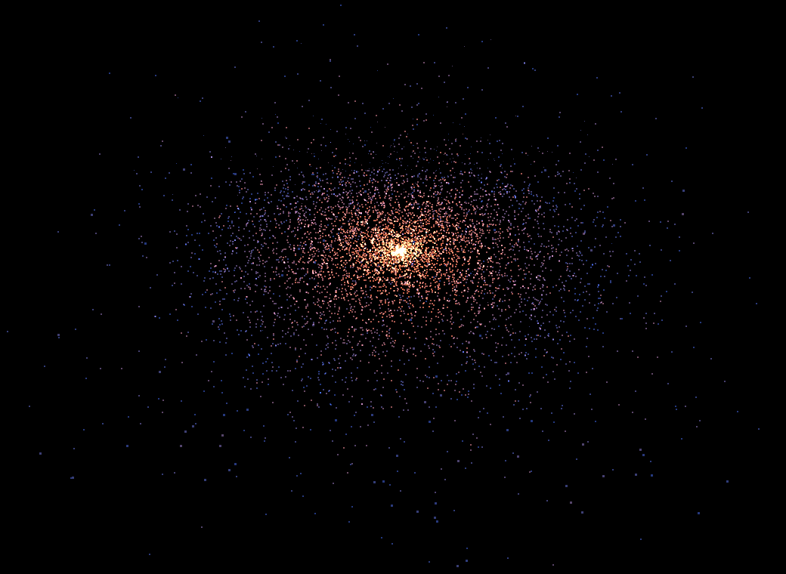
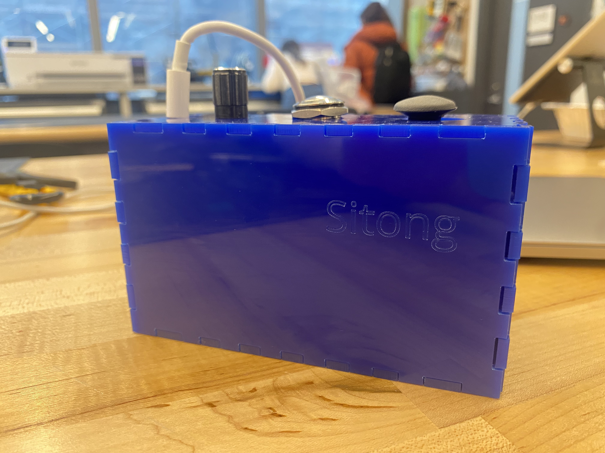

# Interactive Big Bang

The project uses interactive controller to manipulate and create one's custom universe. See detailed [project](https://water-honeydew-380.notion.site/Interactive-Big-Bang-82fa3e4c468e4e0d86211cccd4c22275)page for hardware guide.

space: 


controller: 


Prerequite:
Make sure Node.js is downloaded.

Then use the following command to run the program under the project path:

``` bash
# install dependencies on the initial run
npm install

# Run the local server at localhost:8080
npm run dev
```

